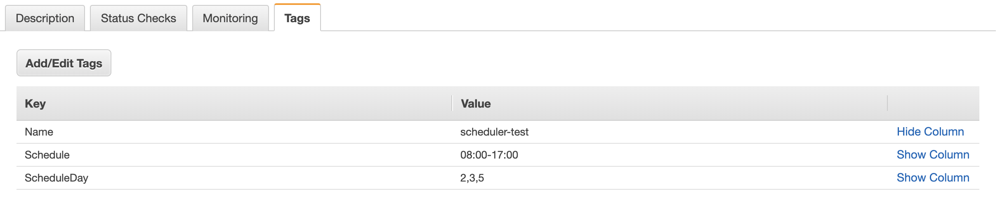

# ⏰ ec2scheduler
Set of Lambda functions to manage the scheduling of EC2 instances via resource tags.



### Features
- basic time range scheduler (09:00-17:00)
- weekday based scheduler (1,2,...)
- scheduler suspension, with automatic unsuspension
- start/stop events notification to an SNS topic
- easy to integrate with chat bots or APIgw
- simple to extend


### Deployment requirements
- golang >= 1.11
- make
- aws cli


## Deployment
Use the included `Makefile` to deploy the resources.

The `OWNER` env var is for tagging. So you can set this to what you want.
The `ENVIRONMENT` env var is also for naming + tagging, but will also be included in CloudWatch logs.
This so you can make out differences between dev, test and prod etc. if you're running them on the same AWS Account.

```bash
AWS_PROFILE=my-profile AWS_REGION=region OWNER=TeamName S3_BUCKET=my-artifact-bucket make deploy
```

Example
```bash
AWS_PROFILE=default AWS_REGION=eu-west-1 OWNER=cloudops S3_BUCKET=my-artifact-bucket make deploy
```

**cn-north-1, cn-northwest-1**: these regions don't support environment variables inside Lambda functions.
Please comment out all the **'Environment:'** blocks in the sam.yaml file. Default tag values will be used in these regions.

### Tags
Tags control the scheduler's logic. Tag names are configurable from the SAM Template
parameters and are exposed to the functions as environment variables.
They all have meaningful default values which should work with most environments.
- Schedule
- ScheduleDay
- ScheduleSuspendUntil
- ScheduleSNS

#### Schedule
required for the scheduler engine to work
```
  times are in UTC
  08:00-19:00   start the instance at 08:00, stop it at 19:00
  19:00-03:00   start the instance at 19:00, stop it at 03:00 the next day
  #08:00-19:00  ignored
```

#### ScheduleDay
optional, defines to which day(s) the scheduler applies
```
  day(s) of the week: 0 Sunday, 1 Monday, ...
  1,2,3,4,5  runs Mon-Fri (default)
  2,3,5      runs Tue, Wed, Fri
```

#### ScheduleSuspendUntil
handle by the ec2schedulerSuspend/Unsuspend/SuspendMon functions. Supported time layouts:
```
2006
200601
20060102
20060102T15
20060102T15:04
```

#### ScheduleSNS
set to SNS topic Arn if you want to send notification of state change:
```
arn:aws:sns:eu-west-1:103145239510:my-topic
```


### Lambda Functions
**ec2scheduler** and **ec2scheduler-suspendmon** are the only required functions.
The others are helpers if you want to expose functionalities via chatbot or APIgw, rather than manually adjust the scheduler values from the AWS console.

- [ec2scheduler](source/scheduler)
- [ec2scheduler-suspendmon](source/scheduler-suspend-mon)
- [ec2scheduler-disable](source/scheduler-disable) - optional
- [ec2scheduler-set](source/scheduler-set) - optional
- [ec2scheduler-status](source/scheduler-status) - optional
- [ec2scheduler-suspend](source/scheduler-suspend) - optional
- [ec2scheduler-unsuspend](source/scheduler-unsuspend) - optional

#### ec2scheduler
Scheduler engine, runs every 5 minutes to verify tagged EC2 instances (**Schedule** tag) should be running (status 16) or stopped (status 80).


#### ec2scheduler-set
Set the scheduler for instanceId (create tag if doesn't exists, modify if it exists). Event format:

```json
{
    "instanceId": "i-00e92a5a9cb7eeb4d",
    "rangeTime": "07:00-19:00"
}
```

```json
{
    "instanceId": "i-00e92a5a9cb7eeb4d",
    "rangeTime": "07:00-19:00",
    "rangeWeekdays": "2,3,5"
}
```


#### ec2scheduler-disable
Disable scheduler for instanceId. Event format:

```json
{
    "instanceId": "i-00e92a5a9cb7eeb4d"
}
```


#### ec2scheduler-status
Returns a list of instanceIds and their scheduler settings.
Output formats are set via environment variable, supported formats are:
- teams (Microsoft Teams)
- text
```
Environment:
  Variables:
    OUTPUT_FORMAT: teams
```

Output example:
```
○ i-031bd5a2e650bfzf9 [dev-environment-server01]
State: running
Schedule: 06:30-17:30
ScheduleSNS: arn:aws:sns:eu-west-1:123456789012:some-sns

```


#### ec2scheduler-suspend
Suspend a scheduler until **ScheduleSuspendUntil** tag. Adds **ScheduleSuspendUntil** tag and comment out **Schedule** tag. Event format:

```json
{
    "instanceId": "i-00e92a5a9cb7eeb4d",
    "unsuspendDatetime": "20171117"
}
```


#### ec2scheduler-unsuspend
Unsuspend a scheduler. Delete **ScheduleSuspendUntil** tag and uncomment **Schedule** tag. Event format:

```json
{
     "instanceId": "i-00e92a5a9cb7eeb4d"
}
```


#### ec2scheduler-suspendmon
Scheduled function that monitors the **ScheduleSuspendUntil** tag.
In case the suspend time is expired, the scheduler is unsuspended.

